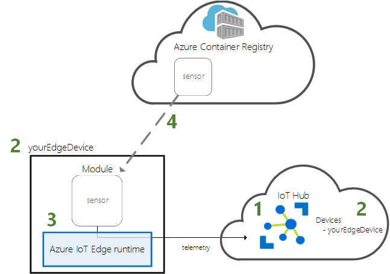
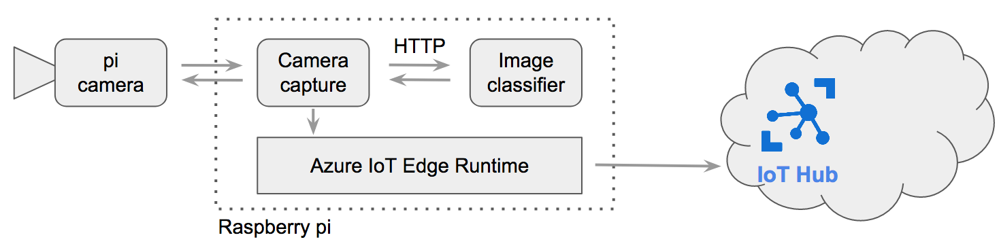

# smart-bartender-iot-edge

## Introduction

The following image shows how IoT Edge and Azure Cloud interact.

1) Create an IoT Hub and a Azure Container registry in your Azure account
2) Register your device in IoT Hub
3) Install and run IoT Edge Runtime on device as shown in this [link](https://docs.microsoft.com/en-us/azure/iot-edge/how-to-install-iot-edge-linux)
4) Deploy your module in Azure Container Registry. Azure IoT Edge Runtime will automatically download and install your model.

## Architecture in device

To install IoT Edge in your raspberry pi, you have to follow this [link](https://docs.microsoft.com/en-us/azure/iot-edge/how-to-install-iot-edge-linux).

In our use case `smart-bartender`, here is the architecture of modules installed in ioT Edge : 

There are two modules :

- Image classifier : HTTP server that can receive image and classify it thanks to a deep learning model
- Camera Capture : read video frame from pi camera and send a HTTP to Image classifier`. Then, send response to IoT Hub

## Get started

### To deploy the solution on a Raspberry Pi 3

From your mac or PC:

1) Clone this sample
2) Update the EdgeSolution/.env file with the values for your container registry and make sure that your docker engine has access to it.
From project [smart-bartender](https://github.com/xebia-france/smart-bartender.git) you can get those values as output
3) Build the entire solution by right-clicking on the EdgeSolution/deployment.template.json file and select Build IoT Edge Solution (this can take a while...especially to build open-cv, tensorflow...)
4) Deploy the solution to your device by right-clicking on the EdgeSolution/config/deployment.json file, select Create Deployment for IoT Edge device and choose your targeted device or by specifying the connection string or your IoT Hub (one of the output of `smart-bartender`)

## Going further

### Update the AI model

We use the image recognition model developed by [Tensorflorw](https://www.tensorflow.org/tutorials/images/image_recognition).
If you want to replace it by our own model, you just need to : 

1) Add your model in this folder `smart-bartender-iot-edge/EdgeSolution/modules/image-classifier-service/model/`
2) Update `smart-bartender-iot-edge/EdgeSolution/modules/image-classifier-service/Dockerfile.arm32v7` in order to import necessary libraries for your model
